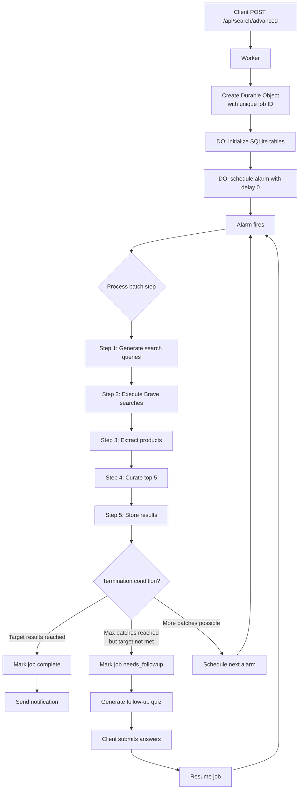

# Durable Object Workflow for Scout AI Agent Orchestration

## Overview

This design integrates Cloudflare Durable Objects with SQLite persistence and Alarm API to enable multi‑step, stateful AI agent workflows for Scout. The pattern allows long‑running searches that can be paused, resumed, and iteratively improved with follow‑up questions.

## Architecture Diagram



## Components

### 1. Durable Object Class: `SearchJobDO`

- **State**: Each job is a separate Durable Object instance identified by `jobId`.
- **Storage**: Built‑in SQLite database (`state.storage.sql`) for job metadata, batch results, and artifacts.
- **Alarm‑driven loop**: The `alarm` method executes the next batch step and schedules the next alarm until termination.
- **HTTP interface**: The `fetch` method handles start, status, results, cancellation, streaming, follow‑up, and resume requests.

### 2. SQLite Schema (per‑DO)

```sql
CREATE TABLE search_job (
  id TEXT PRIMARY KEY,
  client_id TEXT NOT NULL,
  status TEXT NOT NULL DEFAULT 'pending',
  batch_num INTEGER DEFAULT 0,
  quiz_responses TEXT,
  followup_responses TEXT,
  driver_provider TEXT,
  swarm_provider TEXT,
  created_at TEXT DEFAULT (datetime('now')),
  updated_at TEXT DEFAULT (datetime('now')),
  error TEXT,
  total_input_tokens INTEGER DEFAULT 0,
  total_output_tokens INTEGER DEFAULT 0
);

CREATE TABLE domain_results (
  id INTEGER PRIMARY KEY AUTOINCREMENT,
  batch_num INTEGER NOT NULL,
  domain TEXT NOT NULL UNIQUE,
  tld TEXT NOT NULL,
  status TEXT NOT NULL,
  price_cents INTEGER,
  score REAL DEFAULT 0,
  flags TEXT DEFAULT '[]',
  evaluation_data TEXT,
  created_at TEXT DEFAULT (datetime('now'))
);

CREATE TABLE search_artifacts (
  id INTEGER PRIMARY KEY AUTOINCREMENT,
  batch_num INTEGER NOT NULL,
  artifact_type TEXT NOT NULL,
  content TEXT NOT NULL,
  created_at TEXT DEFAULT (datetime('now'))
);
```

*Note: The schema above is from the domain search example. For Scout we need to adapt to product results.*

### 3. Adapted Schema for Scout

```sql
-- Job metadata
CREATE TABLE scout_job (
  id TEXT PRIMARY KEY,
  user_id TEXT NOT NULL,
  query_freeform TEXT,
  query_structured TEXT,
  status TEXT NOT NULL DEFAULT 'pending', -- pending, running, completed, needs_followup, failed, cancelled
  batch_num INTEGER DEFAULT 0,
  followup_quiz TEXT, -- JSON of follow-up questions
  followup_responses TEXT, -- JSON of user answers
  driver_provider TEXT DEFAULT 'claude',
  swarm_provider TEXT DEFAULT 'claude',
  created_at TEXT DEFAULT (datetime('now')),
  updated_at TEXT DEFAULT (datetime('now')),
  error TEXT,
  total_input_tokens INTEGER DEFAULT 0,
  total_output_tokens INTEGER DEFAULT 0,
  credits_used INTEGER DEFAULT 0,
  target_results INTEGER DEFAULT 5,
  max_batches INTEGER DEFAULT 3
);

-- Product results (cumulative across batches)
CREATE TABLE scout_results (
  id INTEGER PRIMARY KEY AUTOINCREMENT,
  batch_num INTEGER NOT NULL,
  product_name TEXT NOT NULL,
  retailer TEXT NOT NULL,
  url TEXT NOT NULL,
  price_cents INTEGER,
  original_price_cents INTEGER,
  confidence INTEGER, -- 0-100 from orchestrator
  match_score INTEGER, -- 0-100 from curator
  match_reason TEXT,
  flags TEXT DEFAULT '[]', -- JSON array of flags e.g., ["best_value", "top_match"]
  created_at TEXT DEFAULT (datetime('now')),
  UNIQUE(product_name, retailer, url) -- prevent duplicates across batches
);

-- Intermediate artifacts (search queries, raw search results, etc.)
CREATE TABLE scout_artifacts (
  id INTEGER PRIMARY KEY AUTOINCREMENT,
  batch_num INTEGER NOT NULL,
  artifact_type TEXT NOT NULL, -- 'search_queries', 'brave_results', 'orchestrator_output', 'curator_output'
  content TEXT NOT NULL, -- JSON
  created_at TEXT DEFAULT (datetime('now'))
);
```

### 4. TypeScript Interfaces

```typescript
interface ScoutJob {
  id: string;
  user_id: string;
  query_freeform?: string;
  query_structured?: Record<string, any>;
  status: 'pending' | 'running' | 'completed' | 'needs_followup' | 'failed' | 'cancelled';
  batch_num: number;
  followup_quiz?: FollowupQuiz;
  followup_responses?: Record<string, any>;
  driver_provider: string;
  swarm_provider: string;
  created_at: string;
  updated_at: string;
  error?: string;
  total_input_tokens: number;
  total_output_tokens: number;
  credits_used: number;
  target_results: number;
  max_batches: number;
}

interface ScoutResult {
  id: number;
  batch_num: number;
  product_name: string;
  retailer: string;
  url: string;
  price_cents: number;
  original_price_cents?: number;
  confidence: number;
  match_score: number;
  match_reason: string;
  flags: string[];
  created_at: string;
}

interface ScoutArtifact {
  id: number;
  batch_num: number;
  artifact_type: 'search_queries' | 'brave_results' | 'orchestrator_output' | 'curator_output';
  content: any;
  created_at: string;
}

interface FollowupQuiz {
  questions: Array<{
    id: string;
    text: string;
    type: 'multiple_choice' | 'range' | 'text';
    options?: string[];
  }>;
}
```

### 4. Batch Processing Steps

Each batch corresponds to one iteration of the search‑curation loop. A batch includes:

1. **Driver agent**: Generate search queries based on user query and profile.
2. **Brave search execution**: Run up to 5 search queries in parallel.
3. **Orchestrator agent**: Extract product candidates from search results.
4. **Curator agent**: Select top 5 products, compute match scores and reasons.
5. **Store results** into `scout_results` and update job status.

Termination conditions:
- **Success**: At least 5 high‑confidence products found (or after N batches).
- **Needs follow‑up**: After max batches (e.g., 3) without enough good results, generate a quiz to clarify preferences.
- **Failure**: Error occurred (API failure, etc.).

### 5. Alarm Scheduling

- After each batch, schedule the next alarm with a configurable delay (e.g., 10 seconds to respect rate limits).
- Use `state.storage.setAlarm(Date.now() + delayMs)`.
- The `alarm` method retrieves job state from SQLite, runs the next batch, and decides whether to continue.

### 6. AI Provider Abstraction

Define a common interface for AI providers (Claude, DeepSeek, Kimi, Cloudflare AI). Each provider implements:

```typescript
interface AIProvider {
  supportsTools: boolean;
  generate(options: GenerateOptions): Promise<ProviderResponse>;
  generateWithTools(options: GenerateWithToolsOptions): Promise<ProviderResponse>;
}
```

Provider selection can be configured per job via request parameters.

### 7. API Endpoints

- `POST /api/search/advanced` – Start a new advanced search job.
- `GET /api/search/advanced/:id` – Get job status and metadata.
- `GET /api/search/advanced/:id/results` – Get final or partial results.
- `GET /api/search/advanced/:id/stream` – Server‑Sent Events for real‑time updates.
- `GET /api/search/advanced/:id/followup` – Retrieve follow‑up quiz (if status = `needs_followup`).
- `POST /api/search/advanced/:id/followup` – Submit follow‑up answers and resume job.
- `POST /api/search/advanced/:id/cancel` – Cancel a running job.

### 8. Integration with Existing System

- Keep the simple search (`/api/search`) unchanged for fast, single‑batch searches.
- Advanced search is opt‑in, triggered by a new endpoint or a query parameter.
- The Durable Object workflow uses the same AI agents and Brave search, but adds state persistence and multi‑batch capabilities.

## Deployment Considerations

- Update `wrangler.toml` with Durable Object binding and migrations.
- Add environment variables for additional AI provider API keys.
- Ensure alarms have at least 30‑second granularity; fine‑grained delays may not be exact.
- Monitor SQLite storage limits (≈2 GB per DO).

## Next Steps

1. Finalize schema and define TypeScript interfaces.
2. Implement the Durable Object class skeleton.
3. Create SQLite table creation functions.
4. Implement batch processing logic.
5. Add AI provider abstraction.
6. Create API endpoints.
7. Test locally with `wrangler dev`.
8. Deploy to production.
